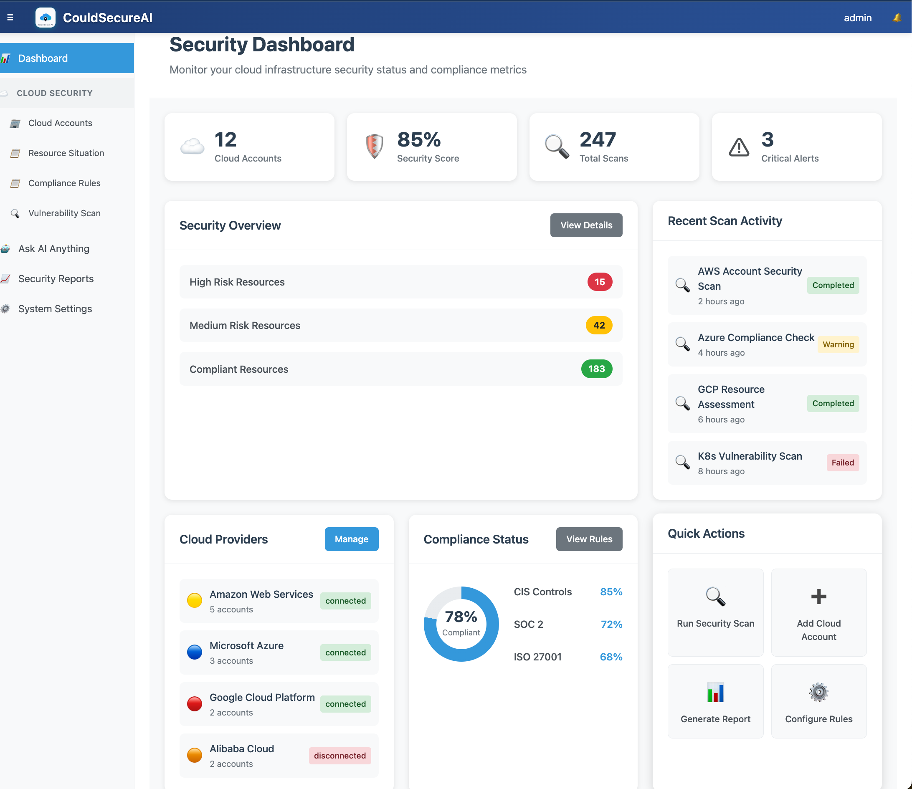
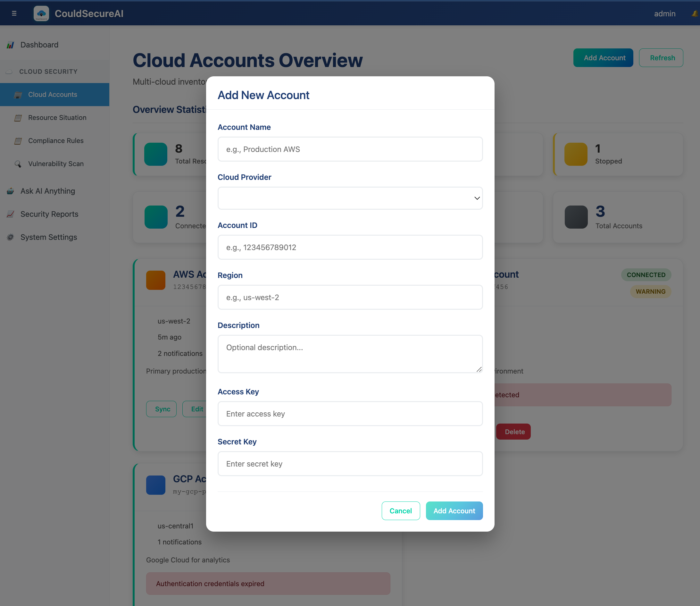
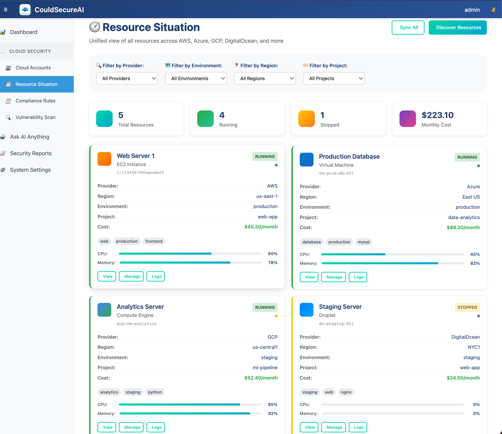
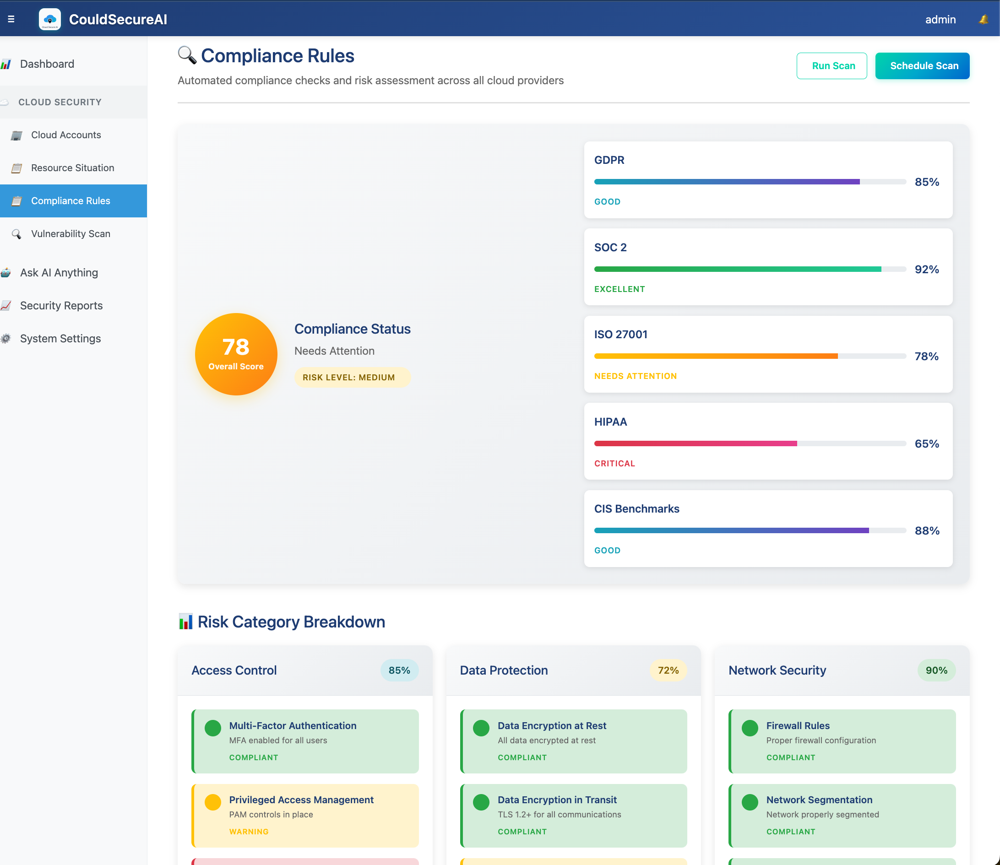
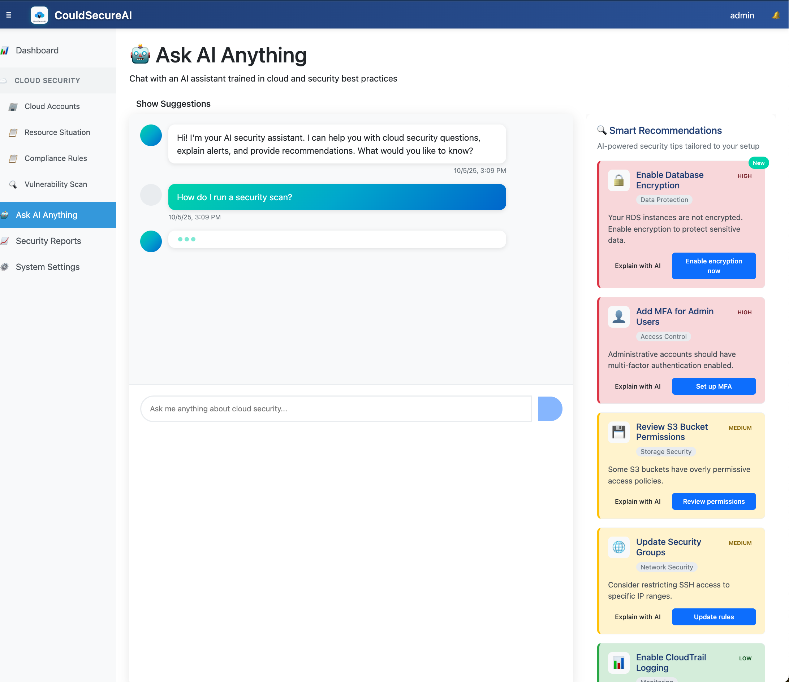
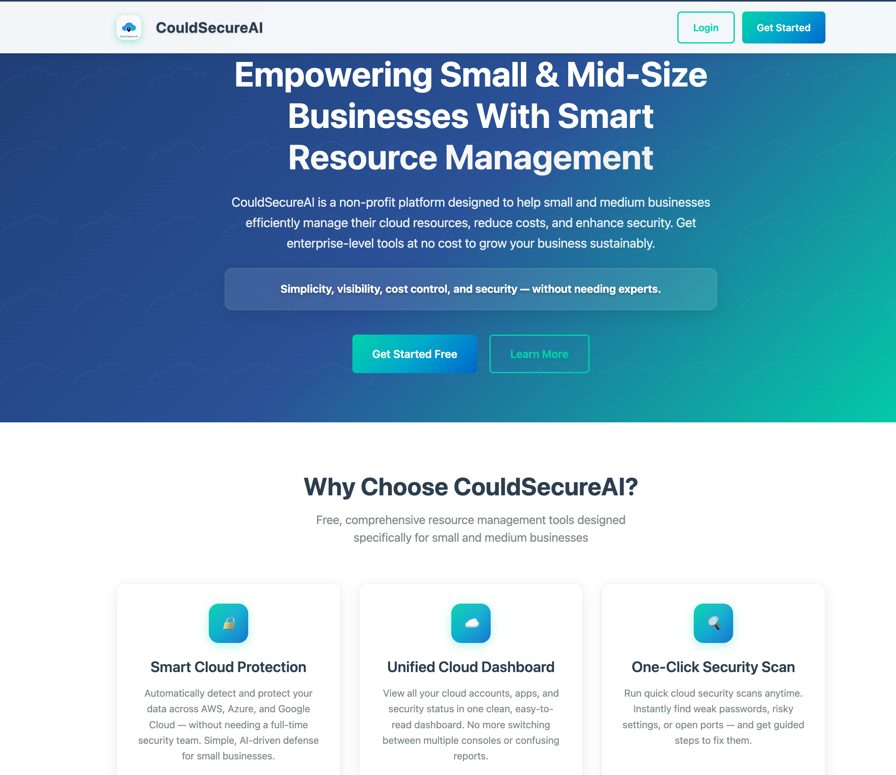
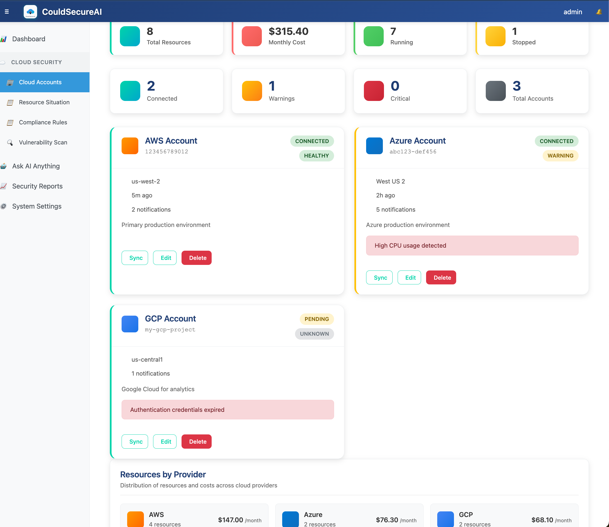
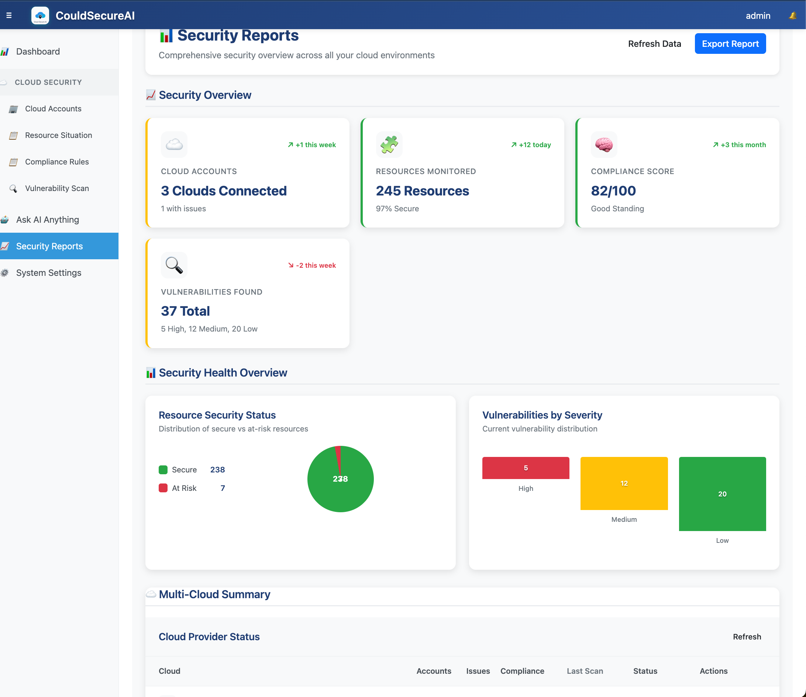
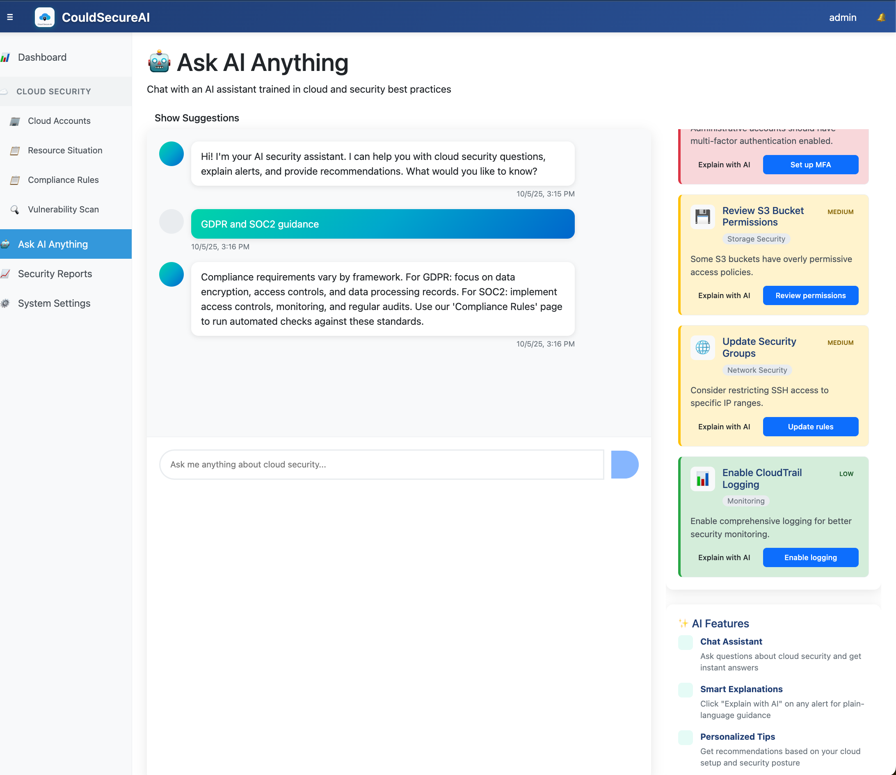

# CloudSecure AI - Empowering Small Businesses with Free Cloud Security

**A comprehensive, free cloud security platform designed specifically for small and medium businesses (SMBs) to protect their digital assets without the need for expensive IT expertise.**

## Mission Statement

CloudSecure AI is a **non-profit, community-driven initiative** dedicated to democratizing cloud security for small businesses worldwide. We believe that every business, regardless of size, deserves enterprise-grade security protection without the enterprise price tag.

## Why Small Businesses Need CloudSecure AI

### The Challenge
- **60% of small businesses** that suffer a cyber attack go out of business within 6 months
- **43% of cyber attacks** target small businesses, yet only **14% are prepared**
- **Average cost** of a data breach for SMBs: **$200,000+**
- **Lack of IT expertise** and **limited budgets** make security seem impossible

### Our Solution
CloudSecure AI provides **enterprise-grade security tools** that are:
- **100% Free Forever** - No hidden costs or subscription fees
- **Simple to Use** - No technical expertise required
- **Comprehensive** - Covers all major cloud providers (AWS, Azure, GCP)
- **AI-Powered** - Smart recommendations and automated protection

---

## Application Pages & Features

### **Home Page - Your Security Command Center**
**Purpose**: Central hub for understanding your cloud security posture

**Key Features**:
- **Real-time Security Score** - Instant visibility of your cloud health
- **Quick Action Buttons** - One-click security scans and compliance checks
- **Recent Alerts** - Latest security findings that need attention
- **Resource Overview** - Total cloud resources being monitored

**Small Business Benefits**:
- **Instant Peace of Mind** - Know your security status at a glance
- **No Technical Jargon** - Simple, business-friendly language
- **Actionable Insights** - Clear next steps for any issues found

### **Cloud Accounts - Multi-Cloud Management**
**Purpose**: Connect and manage all your cloud accounts in one place

**Key Features**:
- **Multi-Cloud Support** - AWS, Azure, Google Cloud, DigitalOcean, Linode
- **Account Health Monitoring** - Real-time status of each cloud account
- **Cost Tracking** - Monthly spending across all providers
- **Resource Inventory** - Complete list of all cloud resources

**Small Business Benefits**:
- **Unified View** - Manage all clouds from one dashboard
- **Cost Control** - Track spending and identify waste
- **Easy Setup** - Connect accounts with simple API keys
- **No Vendor Lock-in** - Work with any cloud provider

### **Resource Situation - Complete Cloud Visibility**
**Purpose**: See everything running across all your cloud environments

**Key Features**:
- **Resource Discovery** - Automatically find all VMs, databases, storage
- **Environment Tagging** - Organize by project, environment (prod/dev/test)
- **Real-time Status** - Live updates on resource health
- **Cost Analysis** - Identify expensive resources and optimization opportunities

**Small Business Benefits**:
- **Complete Visibility** - Never lose track of cloud resources again
- **Cost Optimization** - Find and eliminate unnecessary spending
- **Environment Management** - Keep production and development separate
- **Resource Rightsizing** - Ensure you're not overpaying for resources

### **Compliance Rules - Stay Compliant, Stay Protected**
**Purpose**: Automated compliance checking against industry standards

**Key Features**:
- **GDPR Compliance** - European data protection standards
- **SOC 2 Type II** - Security and availability controls
- **ISO 27001** - Information security management
- **HIPAA-Lite** - Healthcare data protection (simplified)
- **CIS Benchmarks** - Industry-standard security configurations

**Small Business Benefits**:
- **Audit Ready** - Always prepared for compliance audits
- **Customer Trust** - Show clients you take security seriously
- **Legal Protection** - Meet regulatory requirements automatically
- **Competitive Advantage** - Stand out with certified security practices

### **Vulnerability Scan - Proactive Security Protection**
**Purpose**: Find and fix security vulnerabilities before they become problems

**Key Features**:
- **Automated Scanning** - Daily, weekly, or monthly security scans
- **Severity Classification** - Critical, High, Medium, Low risk levels
- **Fix Recommendations** - Step-by-step remediation guidance
- **Trend Analysis** - Track security improvements over time

**Small Business Benefits**:
- **Proactive Protection** - Find issues before hackers do
- **Simple Fixes** - Clear instructions for non-technical users
- **Peace of Mind** - Know your systems are secure
- **Insurance Benefits** - Better rates with proven security measures

### **Ask AI Anything - Your Personal Security Expert**
**Purpose**: Get instant, expert advice on cloud security questions

**Key Features**:
- **Natural Language Queries** - Ask questions in plain English
- **Instant Explanations** - Understand security alerts and recommendations
- **Best Practice Guidance** - Learn industry-standard security practices
- **Custom Recommendations** - Tailored advice for your specific setup

**Small Business Benefits**:
- **Free Expert Consultation** - No need to hire expensive security consultants
- **24/7 Availability** - Get help whenever you need it
- **Learning Resource** - Improve your team's security knowledge
- **Confidence Building** - Make informed security decisions

### **Security Reports - Executive-Level Insights**
**Purpose**: Generate comprehensive security reports for stakeholders

**Key Features**:
- **Executive Dashboards** - High-level security metrics and trends
- **Compliance Reports** - Detailed compliance status and gaps
- **Cost Analysis** - Security spending and ROI calculations
- **Risk Assessment** - Current risk levels and mitigation strategies

**Small Business Benefits**:
- **Board Presentations** - Professional reports for stakeholders
- **Insurance Documentation** - Proof of security measures for insurers
- **Customer Assurance** - Demonstrate security commitment to clients
- **Investment Justification** - Show ROI of security investments

---

## How CloudSecure AI Helps Small Businesses

### **Retail & E-commerce**
- **Payment Security** - Protect customer payment data
- **Inventory Management** - Secure cloud-based inventory systems
- **Customer Data** - GDPR and CCPA compliance for customer information
- **Online Store Security** - Protect e-commerce platforms and customer accounts

### **Healthcare & Medical**
- **Patient Data Protection** - HIPAA compliance for patient records
- **Telemedicine Security** - Secure video consultations and remote monitoring
- **Medical Device Security** - Protect connected medical devices
- **Pharmacy Systems** - Secure prescription and medication management

### **Financial Services**
- **Client Data Protection** - Secure financial records and transactions
- **Regulatory Compliance** - Meet banking and financial regulations
- **Fraud Prevention** - Detect and prevent financial fraud
- **Audit Preparation** - Maintain detailed security logs for audits

### **Manufacturing & Industrial**
- **Supply Chain Security** - Protect manufacturing and logistics data
- **IoT Device Security** - Secure connected manufacturing equipment
- **Intellectual Property** - Protect proprietary designs and processes
- **Quality Control** - Secure quality management systems

### **Education & Non-profits**
- **Student Data Protection** - FERPA compliance for educational records
- **Research Security** - Protect academic research and intellectual property
- **Donor Information** - Secure donor and supporter databases
- **Grant Compliance** - Meet federal and state grant requirements

### **Professional Services**
- **Client Confidentiality** - Protect sensitive client information
- **Document Security** - Secure legal, accounting, and consulting documents
- **Communication Security** - Protect client communications and meetings
- **Regulatory Compliance** - Meet industry-specific regulations

---

## Getting Started - Simple Setup for Any Business

### **Step 1: Sign Up (2 minutes)**
- Create your free account
- No credit card required
- No commitment or contracts

### **Step 2: Connect Your Clouds (5 minutes)**
- Add your AWS, Azure, or Google Cloud accounts
- Simple API key setup with guided instructions
- Automatic resource discovery

### **Step 3: Run Your First Scan (1 minute)**
- One-click security scan
- Instant results and recommendations
- Clear, actionable next steps

### **Step 4: Stay Protected (Ongoing)**
- Automated daily security monitoring
- Real-time alerts for new threats
- Regular compliance checking

---

## Security Features That Protect Your Business

### **Automated Protection**
- **24/7 Monitoring** - Continuous security surveillance
- **Threat Detection** - Identify and block security threats
- **Vulnerability Scanning** - Find and fix security weaknesses
- **Compliance Checking** - Ensure regulatory compliance

### **AI-Powered Intelligence**
- **Smart Recommendations** - Personalized security advice
- **Risk Assessment** - Understand your security posture
- **Threat Analysis** - Identify potential security risks
- **Optimization Suggestions** - Improve security and reduce costs

### **Business-Friendly Features**
- **Simple Interface** - No technical expertise required
- **Clear Reporting** - Understand security status at a glance
- **Actionable Insights** - Know exactly what to do next
- **Cost Optimization** - Reduce cloud spending while improving security

---

## Real Business Impact

### **Before CloudSecure AI**
- ❌ **Unclear Security Status** - Don't know if you're protected
- ❌ **Expensive Consultants** - $200+ per hour for security advice
- ❌ **Complex Tools** - Difficult to use enterprise security software
- ❌ **Compliance Confusion** - Unclear regulatory requirements
- ❌ **Reactive Security** - Only find out about problems after they happen

### **After CloudSecure AI**
- ✅ **Clear Security Dashboard** - Always know your protection status
- ✅ **Free Expert Guidance** - AI-powered security recommendations
- ✅ **Simple Interface** - Easy-to-use security management
- ✅ **Automated Compliance** - Stay compliant without effort
- ✅ **Proactive Protection** - Prevent problems before they occur

---

## Technical Architecture

```
┌─────────────────────┐    HTTP/REST API    ┌─────────────────────┐
│   Angular Frontend  │ ←─────────────────→ │ Spring Boot Backend │
│   (Port 4200)       │                     │   (Port 8080)       │
│                     │                     │                     │
│ • Multi-Cloud UI    │                     │ • JWT Authentication│
│ • Security Dashboard│                     │ • Cloud Integration │
│ • Compliance Tools  │                     │ • AI Recommendations│
│ • Vulnerability Mgmt│                     │ • H2 Database       │
└─────────────────────┘                     └─────────────────────┘
```

---

## Quick Start Guide

### **Prerequisites**
- Node.js 16+ and npm
- Java 17+
- Maven 3.6+

### **1. Start the Backend Service**
```bash
cd backend-service
mvn clean package -DskipTests
java -jar target/backend-service-1.0.0.jar
```
Backend runs on `http://localhost:8080`

### **2. Start the Angular Frontend**
```bash
cd cloud-ui
npm install
ng serve
```
Frontend runs on `http://localhost:4200`

### **3. Access the Application**
Open your browser and navigate to: **http://localhost:4200**

---

## Default Users

| Username | Password | Role  | Email |
|----------|----------|-------|-------|
| `admin`  | `admin123` | ADMIN | admin@cloudsecure.com |
| `user`   | `user123`  | USER  | user@cloudsecure.com |

---

## Key Benefits for Small Businesses

### **Cost Savings**
- **Free Security Tools** - Save $10,000+ annually on security software
- **Reduced Risk** - Avoid costly data breaches ($200,000+ average)
- **Lower Insurance** - Better rates with proven security measures
- **No Consultants** - Eliminate expensive security consulting fees

### ** Time Savings**
- **Automated Monitoring** - No manual security checks needed
- **Instant Alerts** - Get notified immediately of any issues
- **Simple Setup** - Get protected in minutes, not months
- **One-Click Fixes** - Resolve security issues with single clicks

### **Peace of Mind**
- **24/7 Protection** - Continuous security monitoring
- **Expert Guidance** - AI-powered security recommendations
- **Compliance Ready** - Always prepared for audits
- **Customer Trust** - Demonstrate security commitment

### **Business Growth**
- **Competitive Advantage** - Stand out with certified security
- **Customer Confidence** - Build trust with security-conscious clients
- **Regulatory Compliance** - Meet industry requirements easily
- **Scalable Security** - Grow your business without security concerns

---

## Impact on America's Small Business Economy

### **The Numbers**
- **33.2 million small businesses** in the United States
- **99.9% of all businesses** are small businesses
- **61.7 million employees** work for small businesses
- **$5.9 trillion** in economic output from small businesses

### **Our Mission**
CloudSecure AI is committed to protecting America's small business economy by providing:
- **Free Security Tools** for every small business
- **Educational Resources** to improve cybersecurity awareness
- **Community Support** through forums and expert guidance
- **Continuous Innovation** to stay ahead of emerging threats

---

## Community & Support

### **Free Resources**
- **Security Guides** - Step-by-step security tutorials
- **Best Practices** - Industry-standard security recommendations
- **Community Forum** - Connect with other small business owners
- **Expert Webinars** - Regular security education sessions

### **Getting Help**
- **AI Assistant** - 24/7 intelligent security guidance
- **Community Forum** - Peer-to-peer support and advice
- **Documentation** - Comprehensive guides and tutorials
- **Video Tutorials** - Visual learning resources

---

## Demo & Workflow

### Quick Start Demo

**See CloudSecure AI in action with our interactive demo:**

#### 1. **Dashboard Overview**

*Get an instant view of your cloud security posture with real-time metrics and alerts*

#### 2. **Cloud Account Setup**

*Connect your AWS, Azure, and GCP accounts in just a few clicks*

#### 3. **Security Scan Process**

*Watch as our AI scans your cloud infrastructure for vulnerabilities*

#### 4. **Compliance Dashboard**

*Track your compliance status across GDPR, SOC 2, and HIPAA frameworks*

#### 5. **AI Chat Assistant**

*Get instant security advice from our AI-powered assistant*

### Video Walkthrough

**Complete Platform Demo (5 minutes):**
[](https://youtube.com/watch?v=cloudsecure-demo)
*Click to watch the full platform demonstration*

### Step-by-Step Workflow

#### **Step 1: Initial Setup (2 minutes)**
1. **Sign Up** - Create your free account
2. **Connect Cloud Accounts** - Add your AWS/Azure/GCP credentials
3. **Configure Notifications** - Set up email alerts

#### **Step 2: First Security Scan (3 minutes)**
1. **Run Initial Scan** - Click "Scan Now" button
2. **Review Results** - See your security score and findings
3. **Fix Critical Issues** - Follow guided remediation steps

#### **Step 3: Ongoing Monitoring (Daily)**
1. **Check Dashboard** - Review daily security status
2. **Address Alerts** - Respond to new security findings
3. **AI Consultation** - Ask questions via chat interface

### Interactive Demo Features

#### **Live Demo Environment**
- **Try Before You Buy** - Test with sample cloud data
- **No Setup Required** - Pre-configured demo environment
- **Real-time Results** - See actual security scans in action

#### **Demo Scenarios**
- **Small E-commerce Store** - Protect customer payment data
- **SaaS Startup** - Secure multi-tenant application
- **Healthcare Practice** - HIPAA compliance made simple
- **Financial Services** - SOC 2 Type II compliance

### Screenshots Gallery

#### **Main Dashboard**

*Central hub showing security score, recent alerts, and resource overview*

#### **Cloud Accounts Management**

*Manage all your cloud providers from one unified interface*

#### **Vulnerability Scanner**

*Real-time vulnerability detection with severity classification*

#### **Compliance Reports**

*Automated compliance reporting for audits and certifications*

#### **AI Chat Interface**

*Get instant security guidance from our AI assistant*

---

## Contact & Support

- **Email**: duxinpi@gmail.com, ddxhvm@gmail.com

---

## Join the Movement

**CloudSecure AI is more than just software - it's a movement to protect small businesses worldwide.**

Every small business that joins CloudSecure AI makes our entire community stronger. Together, we're building a more secure digital economy. In the US, this helps strengthen the backbone of our economy by protecting the 33.2 million small businesses that employ nearly half of all American workers.

**Start protecting your business today - it's free, it's simple, and it's powerful.**

---

---

## License

Copyright (c) 2022-2025 **Xinpi Du** (duxinpi@gmail.com)

Permission is hereby granted, free of charge, to any person obtaining a copy
of this software and associated documentation files (the "Software"), to deal
in the Software without restriction, including without limitation the rights
to use, copy, modify, merge, publish, distribute, sublicense, and/or sell
copies of the Software, and to permit persons to whom the Software is
furnished to do so, subject to the following conditions:

The above copyright notice and this permission notice shall be included in all
copies or substantial portions of the Software.

THE SOFTWARE IS PROVIDED "AS IS", WITHOUT WARRANTY OF ANY KIND, EXPRESS OR
IMPLIED, INCLUDING BUT NOT LIMITED TO THE WARRANTIES OF MERCHANTABILITY,
FITNESS FOR A PARTICULAR PURPOSE AND NONINFRINGEMENT. IN NO EVENT SHALL THE
AUTHORS OR COPYRIGHT HOLDERS BE LIABLE FOR ANY CLAIM, DAMAGES OR OTHER
LIABILITY, WHETHER IN AN ACTION OF CONTRACT, TORT OR OTHERWISE, ARISING FROM,
OUT OF OR IN CONNECTION WITH THE SOFTWARE OR THE USE OR OTHER DEALINGS IN THE
SOFTWARE.

---

*CloudSecure AI - Empowering Small Businesses with Enterprise-Grade Security*